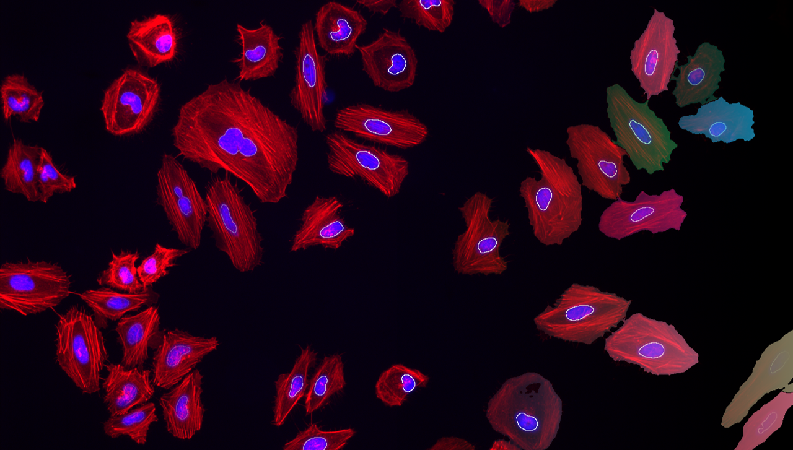
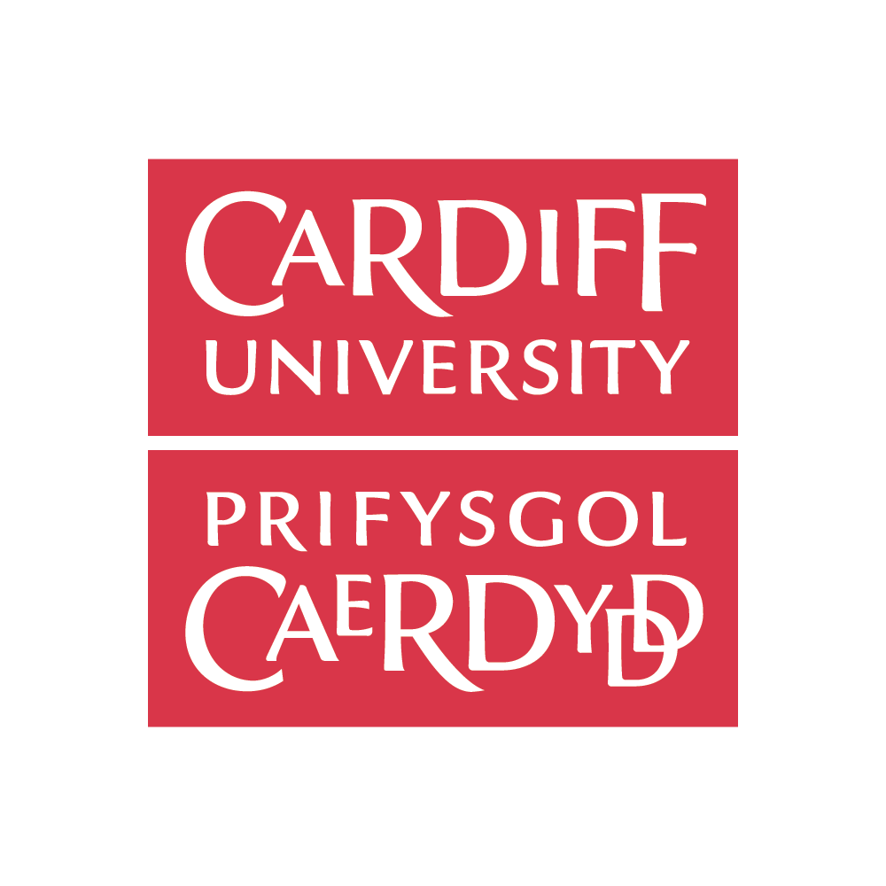

### 18th - 20th May 2026, University of Cardiff, Wales

# Overview

In this workshop, we will bridge the gap between advanced microscopy data generation and the computational skills required for its analysis. By leveraging open-source tools like [FIJI](https://fiji.sc), [Jupyter notebooks](https://jupyter.org/) and [napari](https://napari.org), participants will learn to automate image analysis, enhancing the precision, efficiency, and reproducibility of their research. This three-day event, led by experienced core facility staff from the Francis Crick Institute and the University of Cardiff, offers a practical approach to mastering quantitative analysis and workflow automation, essential for advancing research across multiple domains.

>Applications for this workshop have now closed.

# Instructors
* [Dave Barry, Francis Crick Institute](https://www.crick.ac.uk/research/find-a-researcher/david-barry)
* [Martin Jones, Francis Crick Institute](https://www.crick.ac.uk/research/find-a-researcher/martin-jones)
* [Stefania Marcotti, Francis Crick Institute](https://www.crick.ac.uk/research/find-a-researcher/stefania-marcotti)
* [Sara Salgueiro Torres, Francis Crick Institute](https://www.crick.ac.uk/research/find-a-researcher/sara-salgueiro-torres)
* [Tom Slater, University of Cardiff](https://profiles.cardiff.ac.uk/staff/slatert2)

# Preparation

1. Please remember to bring your laptop (and charger).
2. Please install the required software before the workshop - follow the installation instructions on [this page](Pages/Installation-Instructions.md).
3. Download the workshop data by clicking on the link to the ZIP archive at the top of this page.
4. You will be assigned to a specific group, with whom you will be sitting - your group number will be displayed in the training room.
5. **PLEASE CONTACT US BEFORE THE WORKSHOP IF YOU ENCOUNTER ANY DIFFICULTIES WITH ANY OF THE ABOVE.**

# Program (draft)

**Please note that all catering, as well as attendance of the social on the evening of the 18th, is covered by your registration fee.**

<table style="width:100%">
	<tbody>
		<tr>
			<th colspan=3>Monday, May 18th 2026</th>
		</tr>
		<tr>
			<td>09:30 - 10:00</td>
			<td colspan=2>Registration</td>
		</tr>
		<tr>
			<td>10:00 - 11:30</td>
			<td>Session 1</td>
			<td>
Introduction & Installations
</td>
		</tr>
		<tr>
			<td></td>
			<td colspan=3>
				<ul>
					<li>Dave Barry</li>
					<ul><li>Who are you and why are you here?</li></ul>
					<li>Stefania Marcotti</li>
					<ul><li>Creating Python environments</li></ul>
					<li>Sara Salgueiro Torres</li>
					<ul>
						<li>Why manual analysis is a bad idea</li>
						<li>Embracing uncertainty</li>
						<li>What is metadata and why do you need it</li>
					</ul>
				</ul>
			</td>
		</tr>
		<tr>
			<td>11:30 - 11:45</td>
			<td colspan=2>Coffee Break</td>
		</tr>
		<tr>
			<td>11:45 - 13:15</td>
			<td>Session 2</td>
			<td>
Image Pre-Processing, Segmentation & Analysis
</td>
		</tr>
		<tr>
			<td></td>
			<td colspan=3>
				<ul>
					<li>Sara Salgueiro Torres</li>
					<ul>
						<li>Basic segmentation using thresholding</li>
						<li>Use of filtering to suppress noise</li>
						<li>Obtaining numbers from images</li>
					</ul>
				</ul>
			</td>
		</tr>
		<tr>
			<td>13:15 - 14:15</td>
			<td colspan=2>Lunch</td>
		</tr>
		<tr>
			<td>14:15 - 15:45</td> 
			<td>Session 3</td>
			<td>
Assembling Pipelines and Interpreting Results
</td>
		</tr>
		<tr>
			<td></td>
			<td colspan=3>
			<ul>
				<li>Sara Salgueiro Torres & Dave Barry</li>
				<ul>
					<li>Counting and quantifying morphology of objects</li>
					<li>Quantifying fluorescence intensities</li>
				</ul>
			</ul>
			</td>
		</tr>
		<tr>
			<td>15:45 - 16:00</td>
			<td colspan=2>Coffee Break</td>
		</tr>
		<tr>
			<td>16:00 - 17:30</td> 
			<td>Session 4</td>
			<td>
Extending Analyses to Three Dimensions
</td>
		</tr>
		<tr>
			<td></td>
			<td colspan=3>
			<ul>
				<li>Dave Barry</li>
				<ul>
					<li>Counting and quantifying morphology of three-dimensional objects</li>
					<li>Quantifying fluorescence intensities of three-dimensional objects</li>
				</ul>
			</ul>
			</td>
		</tr>
		<tr>
			<td>18:00</td>
			<td colspan=2>Dinner: venue TBC</td>
		</tr>
		<tr>
			<th colspan=3>Tuesday, May 19th 2026</th>
		</tr>
		<tr>
			<td>09:00 - 10:30</td>
			<td>Session 5</td>
			<td>
Using GitHub for Code Version Control
</td>
		</tr>
		<tr>
			<td></td>
			<td colspan=3>
				<ul>
				<li>Stefania Marcotti</li>
				<ul>
					<li>Creating repositories</li>
					<li>Tracking changes</li>
					<li>Intro to coding: variables and arrays</li>
				</ul>
				</ul>
			</td>
		</tr>
		<tr>
			<td>10:30 - 10:45</td>
			<td colspan=2>Coffee Break</td>
		</tr>
		<tr>
			<td>10:45 - 12:15</td>
			<td>Session 6</td>
			<td>
Using Jupyter Notebooks for Reproducible Analysis - Part 1
</td>
		</tr>
		<tr>
			<td></td>
			<td colspan=3>
				<ul>
				<li>Stefania Marcotti</li>
				<ul>
					<li>Analysing light microscopy data</li>
					<li>Quantify morphology of objects in a 2D image</li>
				</ul>
				</ul>
			</td>
		</tr>
		<tr>
			<td>12:15 - 13:15</td>
			<td colspan=2>Lunch</td>
		</tr>
		<tr>
			<td>13:15 - 14:45</td>
			<td>Session 7</td>
			<td>
Using Jupyter Notebooks for Reproducible Analysis - Part 2
</td>
		</tr>
		<tr>
			<td></td>
			<td colspan=3>
				<ul>
				<li>Tom Slater</li>
				<ul>
					<li>Analysing electron microscopy data</li>
					<li>Quantify morphology of objects in a 2D image</li>
				</ul>
				</ul>
			</td>
		</tr>
		<tr>
			<td>14:45 - 15:00</td>
			<td colspan=2>Coffee Break</td>
		</tr>
		<tr>
			<td>15:00 - 16:30</td>
			<td>Session 8</td>
			<td>
Introduction to Batch Processing with Jupyter Notebooks
</td>
		</tr>
		<tr>
			<td></td>
			<td colspan=3>
				<ul>
				<li>Stefania Marcotti</li>
				<ul>
					<li>Practical application: analyse all the images in a dataset</li>
				</ul>
				</ul>
			</td>
		</tr>
		<tr>
			<td>16:30 - 16:45</td>
			<td colspan=2>Coffee Break</td>
		</tr>
		<tr>
			<td>16:45 - 18:15</td>
			<td>Session 9</td>
			<td>
Extending Analyses to Three Dimensions in Python
</td>
		</tr>
		<tr>
			<td></td>
			<td colspan=3>
				<ul>
				<li>Tom Slater</li>
				</ul>
			</td>
		</tr>
		<tr>
			<th colspan=3>Wednesday, May 20th 2026</th>
		</tr>
		<tr>
			<td>09:00 - 10:30</td>
			<td>Session 10</td>
			<td>
Using Napari for Image Visualisation
</td>
		</tr>
		<tr>
			<td></td>
			<td colspan=3>
				<ul>
				<li>Martin Jones</li>
				<ul>
					<li>Introduction to napari interface</li>
					<li>Integrating napari into Jupyter notebooks</li>
				</ul>
				</ul>
			</td>
		</tr>
		<tr>
			<td>10:30 - 10:45</td>
			<td colspan=2>Coffee Break</td>
		</tr>
		<tr>
			<td>10:45 - 12:15</td>
			<td>Session 11</td>
			<td>
Introduction to Machine Learning for Image Analysis - Part 1
</td>
		</tr>
		<tr>
			<td></td>
			<td colspan=3>
				<ul>
				<li>Dave Barry</li>
				<ul>
					<li>Annotations and metadata</li>
					<li>Shallow vs. deep learning</li>
					<li>Example software tools for light microscopy data</li>
				</ul>
				</ul>
			</td>
		</tr>
		<tr>
			<td>12:15 - 13:15</td>
			<td colspan=2>Lunch</td>
		</tr>
		<tr>
			<td>13:15 - 14:45</td>
			<td>Session 12</td>
			<td>
Introduction to Machine Learning for Image Analysis - Part 2
</td>
		</tr>
		<tr>
			<td></td>
			<td colspan=3>
				<ul>
				<li>Martin Jones and Tom Slater</li>
				<ul>
					<li>Example software tools for electron microscopy data</li>
					<li>Working with multimodal datasets</li>
				</ul>
				</ul>
			</td>
		</tr>
		<tr>
			<td>14:45 - 15:00</td>
			<td colspan=2>Coffee Break</td>
		</tr>
		<tr>
			<td>15:00 - 15:30</td>
			<td>Session 13</td>
			<td>
Wrap up
</td>
		</tr>
	</tbody>
</table>

# Venue

The workshop will take place in the School of Chemistry, Cardiff University, Cardiff (UK).

# Previous Workshops

| Date | Venue | Content |
| --- | --- | --- |
| 8 / 9th April 2024 | King's College London | [Click here](Pages/KCL_2024.04.08.md)|
| 24 / 25th April 2024 | Royal College of Surgeons in Ireland | [Click here](Pages/RCSI_2024.04.24.md)|
| 21 / 22nd October 2024 | Francis Crick Institute | [Click here](Pages/Crick_2024.10.21.md)|
| 8 / 9th April 2025 | University of Galway, Ireland | [Click here](https://github.com/FrancisCrickInstitute/introduction-to-image-analysis/blob/main/Pages/Galway_2025.04.08.md)|
| 6 & 20th June 2025 | Francis Crick Institute | [Click here](https://github.com/FrancisCrickInstitute/introduction-to-image-analysis/blob/main/Pages/Crick_2025.06.06.md)|
| 18 / 19th August 2025 | Francis Crick Institute | [Click here](https://github.com/FrancisCrickInstitute/introduction-to-image-analysis/blob/main/Pages/Crick_2025.08.18.md)|
| 27 / 28th October 2025 | Francis Crick Institute | [Click here](https://github.com/FrancisCrickInstitute/introduction-to-image-analysis/blob/main/Pages/Crick_2025.10.27.md)|

# FAQ

1. **Do I need any prior knowledge of image analysis, FIJI or napari to attend?**

    No, this workshop is aimed at complete beginners, but a basic understanding of image acquisition would be beneficial.

2. **Do I need to have any experience of coding?**

    While some basic knowledge would be helpful, it's not essential and even if you have no knowledge of python, Jupyter notebooks or FIJI scripts/macros, you should still apply.

	   

