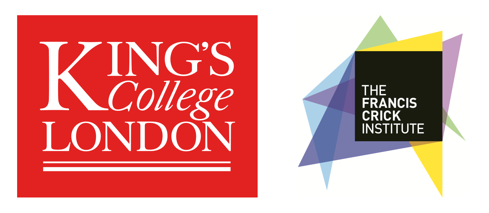

# Overview

In this workshop, we will bridge the gap between advanced microscopy data generation and the computational skills required for its analysis. By leveraging open-source tools like [FIJI](https://fiji.sc) and [napari](https://napari.org), participants will learn to automate image analysis, enhancing the precision, efficiency, and reproducibility of their research. This two-day event, led by experienced core facility staff from the Francis Crick Institute and King's College London, offers a practical approach to mastering quantitative analysis and workflow automation, essential for advancing research across multiple domains.

No fee will be charged for participation, but attendance is restricted to staff from The Crick, King's College London, University College London and Imperial College London.

> The application deadline for this workshop has now passed.

# Instructors
* [Dave Barry, Francis Crick Institute](https://www.crick.ac.uk/research/find-a-researcher/david-barry)
* [Martin Jones, Francis Crick Institute](https://www.crick.ac.uk/research/find-a-researcher/martin-jones)
* [Stefania Marcotti, King's College London](https://www.kcl.ac.uk/people/stefania-marcotti)
* [Vanessa Dao, Francis Crick Institute](https://www.crick.ac.uk/research/find-a-researcher/vanessa-dao)

# Provisional Program

<table>
    <tbody>
        <tr>
            <th colspan=3>Monday, April 8th</th>
        </tr>
        <tr>
            <td>10:00 - 11:00</td>
			<td>Session 1</td>
            <td>Introduction to Image Analysis</td>
        </tr>
        <tr>
            <td></td>
            <td colspan=3>
                <ul>
                    <li>Understanding the importance of image analysis in reproducible science</li>
                    <li>Foundational concepts of image formation and quantification</li>
                </ul>
            </td>
        </tr>
        <tr>
            <td>11:00 - 11:15</td>
            <td colspan=2>Coffee Break</td>
        </tr>
       <tr>
            <td>11:15 - 13:00</td>
			<td>Session 2</td>
            <td>Image Pre-Processing & Segmentation</td>
        </tr>
        <tr>
            <td></td>
            <td colspan=3>
                <ul>
                    <li>Practical Application: Image filtering and basic image segmentation.</li>
                </ul>
            </td>
        </tr>
	<tr>
            <td>13:00 - 14:00</td>
            <td colspan=2>Lunch</td>
        </tr>
	<tr>
            <td>14:00 - 15:30</td>
	    <td>Session 3</td>
            <td>Analysing Images</td>
        </tr>
        <tr>
            <td></td>
            <td colspan=3>
                <ul>
                    <li>Practical Application: Quantifying morphology of objects in a 2D image</li>
                </ul>
            </td>
        </tr>
	<tr>
            <td>15:30 - 15:50</td>
            <td colspan=2>Coffee Break</td>
        </tr>
	<tr>
            <td>15:50 - 17:30</td>
	    <td>Session 4</td>
            <td>Introduction to Batch Processing</td>
        </tr>
        <tr>
            <td></td>
            <td colspan=3>
                <ul>
                    <li>Practical Application: Record commands to form the basis of a script for automated processing and analysis</li>
                </ul>
            </td>
        </tr>
	<tr>
            <td>17:30</td>
            <td colspan=2>Pub</td>
        </tr>
	<tr>
            <th colspan=3>Tuesday, April 9th</th>
        </tr>
        <tr>
            <td>09:30 - 10:30</td>
	    <td>Session 5</td>
            <td>Introduction to Python and installations</td>
        </tr>
        <tr>
            <td></td>
            <td colspan=3>
                <ul>
                    <li>Creating Pyton environments</li>
                    <li>Installing Jupyter notebooks and napari</li>
                </ul>
            </td>
        </tr>
        <tr>
            <td>10:30 - 10:50</td>
            <td colspan=2>Coffee Break</td>
        </tr>
       <tr>
            <td>10:50 - 12:30</td>
	    <td>Session 6</td>
            <td>Using Jupyter Notebooks for Reproducible Analysis</td>
        </tr>
        <tr>
            <td></td>
            <td colspan=3>
                <ul>
                    <li>Variables and arrays</li>
		            <li>Practical Application: quantify morphology of objects in a 2D image with Jupyter</li>
                </ul>
            </td>
        </tr>
	<tr>
            <td>12:30 - 13:30</td>
            <td colspan=2>Lunch</td>
        </tr>
	<tr>
            <td>13:30 - 15:30</td>
	    <td>Session 7</td>
            <td>Using napari as an image analysis tool and as a viewer</td>
        </tr>
        <tr>
            <td></td>
            <td colspan=3>
                <ul>
                    <li>Overview of napari GUI</li>
		            <li>Practical Application: batch processing with Jupyter</li>
                    <li>Practical Application: using napari as a viewer from Jupyter</li>
                </ul>
            </td>
        </tr>
    </tbody>
</table>

# FAQ

1. **Do I need any prior knowledge of image analysis, FIJI or napari to attend?**

    No, this workshop is aimed at complete beginners, but a basic understanding of image acquisition would be beneficial.

2. **Do I need to have any experience of coding?**

    While some basic knowledge would be helpful, it's not essential and even if you have no knowledge of python, Jupyter notebooks or FIJI scripts/macros, you should still apply.

