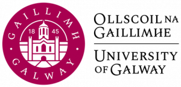

### 8th - 9th April 2025, University of Galway, Ireland

# Overview

In this workshop, we will bridge the gap between advanced microscopy data generation and the computational skills required for its analysis. By leveraging open-source tools like [FIJI](https://fiji.sc) and [napari](https://napari.org), participants will learn to automate image analysis, enhancing the precision, efficiency, and reproducibility of their research. This two-day event, led by experienced core facility staff from the Francis Crick Institute and King's College London, offers a practical approach to mastering quantitative analysis and workflow automation, essential for advancing research across multiple domains.

>Applications for this workshop have now closed.

# Instructors
* [Dave Barry, Francis Crick Institute](https://www.crick.ac.uk/research/find-a-researcher/david-barry)
* [Martin Jones, Francis Crick Institute](https://www.crick.ac.uk/research/find-a-researcher/martin-jones)
* [Stefania Marcotti, King's College London](https://www.kcl.ac.uk/people/stefania-marcotti)
* [Sara Salgueiro Torres, Francis Crick Institute](https://www.crick.ac.uk/research/find-a-researcher/sara-salgueiro-torres)
* [Pascal Paco Farina, University of Galway](https://www.linkedin.com/in/pascal-paco-farina-000502210/)
* [Karolina Salciute, University of Galway](https://www.linkedin.com/in/karolina-salciute/)

# Preparation

1. Please remember to bring your laptop (and charger).
2. Please install the required software before the workshop - follow the installation instructions on [this page](Pages/Installation-Instructions.md).
3. Download the workshop data by clicking on the link to the ZIP archive at the top of this page.
4. You will be assigned to a specific group, with whom you will be sitting - your group number will be displayed in the training room.
5. **PLEASE CONTACT US BEFORE THE WORKSHOP IF YOU ENCOUNTER ANY DIFFICULTIES WITH ANY OF THE ABOVE.**

# Slides

All the slides for the workshop are on Google and accesible [here](https://drive.google.com/drive/folders/1nTeM1MHu74hpmGDSvYeqU-ftX8ANHqI_?usp=sharing).

# Program

**Please note that all catering, as well as attendance of the social on the evening of the 8th, is covered by your registration fee.**

<table style="width:100%">
	<tbody>
		<tr>
			<th colspan=3>Tuesday, April 8th 2025</th>
		</tr>
		<tr>
			<td>09:30 - 10:30</td>
			<td colspan=3> Registration</td>
		</tr>
		<tr>
			<td>10:30 - 11:45</td>
			<td>Session 1</td>
			<td>
Introduction - Automated Image Analysis is Essential for Reproducible Science

Dave Barry
</td>
		</tr>
		<tr>
			<td></td>
			<td colspan=3>
				<ul>
					<li>Why manual analysis is a bad idea</li>
					<li>Embracing uncertainty</li>
					<li>What is metadata and why do you need it</li>
				</ul>
			</td>
		</tr>
		<tr>
			<td>11:45 - 12:00</td>
			<td colspan=2>Coffee Break</td>
		</tr>
		<tr>
			<td>12:00 - 13:30</td>
			<td>Session 2</td>
			<td>
Image Pre-Processing, Segmentation & Analysis

Sara Salgueiro Torres
</td>
		</tr>
		<tr>
			<td></td>
			<td colspan=3>
				<ul>
					<li>Practical Applications:</li>
					<ul>
						<li>Basic segmentation using thresholding</li>
						<li>Use of filtering to suppress noise</li>
						<li>Obtaining numbers from images</li>
					</ul>
				</ul>
			</td>
		</tr>
		<tr>
			<td>13:30 - 13:40</td>
			<td>Tech Bite</td>
			<td>
 How to enhance your experimental workflows through Smart Experiments and JOBs 

 Dylan Donnellan, Lennox 
</td>
		</tr>
		<tr>
			<td>13:40 - 14:40</td>
			<td colspan=2>Lunch</td>
		</tr>
		<tr>
			<td>14:40 - 16:25</td> 
			<td>Session 3</td>
			<td>
Assembling Pipelines and Interpreting Results

Dave Barry
</td>
		</tr>
		<tr>
			<td></td>
			<td colspan=3>
			<ul>
				<li>Practical Applications:</li>
				<ul>
					<li>Counting and quantifying morphology of objects</li>
					<li>Quantifying fluorescence intensities</li>
				</ul>
			</ul>
			</td>
		</tr>
		<tr>
			<td>16:25 - 16:40</td>
			<td colspan=2>Coffee Break</td>
		</tr>
		<tr>
			<td>16:40 - 18:10</td> 
			<td>Session 4</td>
			<td>
Introduction to Batch Processing

Dave Barry
</td>
		</tr>
		<tr>
			<td></td>
			<td colspan=3>
				<ul>
                    <li>Practical Application: </li>
					<ul>
						<li>Record commands to form the basis of a script</li>
					</ul>
                </ul>
			</td>
		</tr>
		<tr>
			<td>18:10 - ?</td>
			<td>Evening Social</td>
			<td>Taylor's Bar, 7 Dominick St Upper, Galway, H91 RP48</td>
		</tr>
		<tr>
			<th colspan=3>Wednesday, April 9th 2025</th>
		</tr>
		<tr>
			<td>09:30 - 10:30</td>
			<td>Session 5</td>
			<td>
Introduction to Python and installations

Stefania Marcotti
</td>
		</tr>
		<tr>
			<td></td>
			<td colspan=3>
				<ul>
					<li>Creating Python environments</li>
					<li>Installing Jupyter notebooks and napari</li>
				</ul>
			</td>
		</tr>
		<tr>
			<td>10:30 - 10:45</td>
			<td colspan=2>Coffee Break</td>
		</tr>
		<tr>
			<td>10:45 - 12:30</td>
			<td>Session 6</td>
			<td>
Using Jupyter Notebooks for Reproducible Analysis

Stefania Marcotti
</td>
		</tr>
		<tr>
			<td></td>
			<td colspan=3>
				<ul>
					<li>Variables and arrays</li>
					<li>Practical Application: quantify morphology of objects in a 2D image with Jupyter</li>
				</ul>
			</td>
		</tr>
		<tr>
			<td>12:30 - 13:30</td>
			<td colspan=2>Lunch</td>
		</tr>
		<tr>
			<td>13:30 - 15:30</td>
			<td>Session 7</td>
			<td>
Using napari as an image analysis tool and as a viewer

Martin Jones
</td>
		</tr>
		<tr>
			<td></td>
			<td colspan=3>
				<ul>
					<li>Overview of napari GUI</li>
					<li>Practical Application: batch processing with Jupyter</li>
					<li>Practical Application: using napari as a viewer from Jupyter</li>
				</ul>
			</td>
		</tr>
	</tbody>
</table>

# Venue

The workshop will take place in the University of Galway, Galway, Ireland:

<iframe src="https://www.google.com/maps/embed?pb=!1m18!1m12!1m3!1d8022.615056807473!2d-9.071864966743952!3d53.28706786442751!2m3!1f0!2f0!3f0!3m2!1i1024!2i768!4f13.1!3m3!1m2!1s0x485b96f169862607%3A0x8b41e03d8f400270!2sUniversity%20of%20Galway!5e0!3m2!1sen!2suk!4v1733484459965!5m2!1sen!2suk" width="100%" height="450" style="border:0;" allowfullscreen="" loading="lazy" referrerpolicy="no-referrer-when-downgrade"></iframe>

On the evening of Tuesday the 8th, we will walk (about 15 minutes) to Taylor's Bar, 7 Dominick St Upper, Galway, H91 RP48 for food and drinks (all covered by your registration fee). These workshops are a terrific networking opportunity, so please join us!
<iframe src="https://www.google.com/maps/embed?pb=!1m18!1m12!1m3!1d149.1304415680158!2d-9.058159225891124!3d53.270059643345625!2m3!1f0!2f0!3f0!3m2!1i1024!2i768!4f13.1!3m3!1m2!1s0x485b974e5cf5a917%3A0xe51a65a9c990ac23!2sTaylor&#39;s%20Bar%20%26%20Beer%20Garden!5e0!3m2!1sen!2suk!4v1741951928391!5m2!1sen!2suk" width="100%" height="450" style="border:0;" allowfullscreen="" loading="lazy" referrerpolicy="no-referrer-when-downgrade"></iframe>

# Organisers
* [Dave Barry, Francis Crick Institute](https://www.crick.ac.uk/research/find-a-researcher/david-barry)
* [Martin Jones, Francis Crick Institute](https://www.crick.ac.uk/research/find-a-researcher/martin-jones)
* [Stefania Marcotti, King's College London](https://www.kcl.ac.uk/people/stefania-marcotti)
* [Kerry Thompson, University of Galway](https://www.universityofgalway.ie/our-research/people/kerrythompson)

# Previous Workshops

| Date | Venue | Content |
| --- | --- | --- |
| 8 / 9th April 2024 | King's College London | [Click here](Pages/KCL_2024.04.08.md)|
| 24 / 25th April 2024 | Royal College of Surgeons in Ireland | [Click here](Pages/RCSI_2024.04.24.md)|
| 21 / 22nd October 2024 | Francis Crick Institute | [Click here](Pages/Crick_2024.10.21.md)|

# FAQ

1. **Do I need any prior knowledge of image analysis, FIJI or napari to attend?**

    No, this workshop is aimed at complete beginners, but a basic understanding of image acquisition would be beneficial.

2. **Do I need to have any experience of coding?**

    While some basic knowledge would be helpful, it's not essential and even if you have no knowledge of python, Jupyter notebooks or FIJI scripts/macros, you should still apply.

	    

