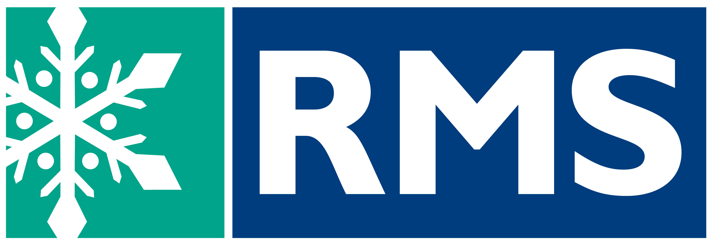
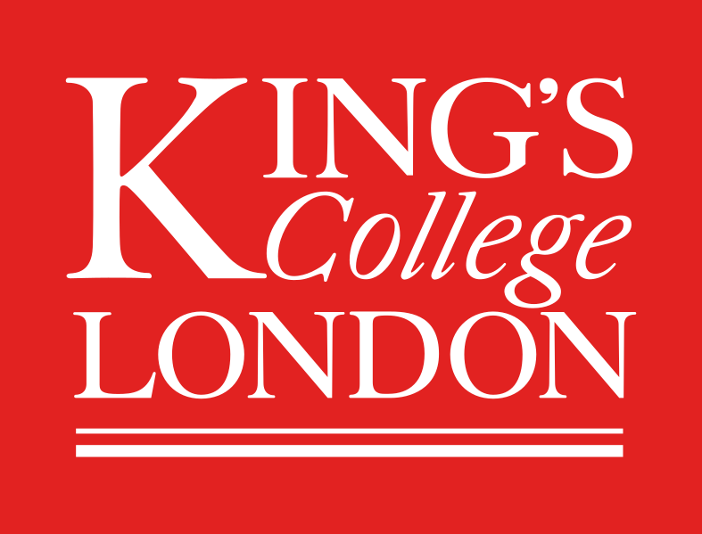
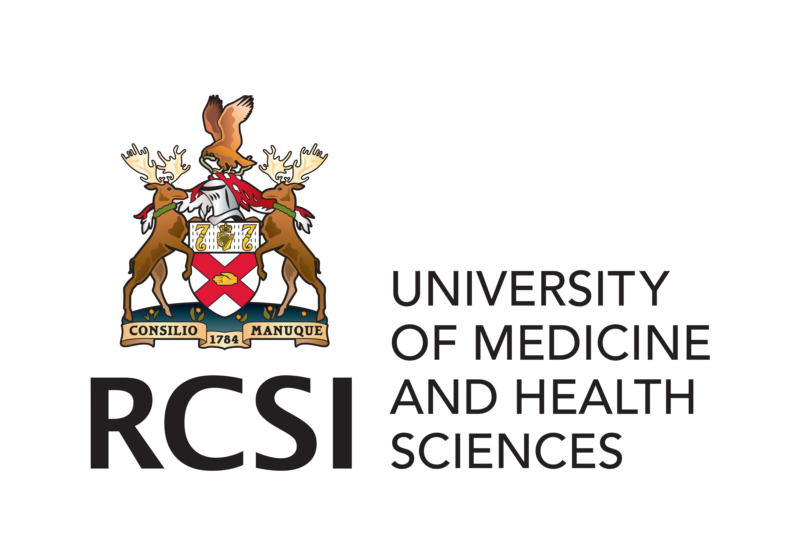

# Overview

In this workshop, we will bridge the gap between advanced microscopy data generation and the computational skills required for its analysis. By leveraging open-source tools like [FIJI](https://fiji.sc) and [napari](https://napari.org), participants will learn to automate image analysis, enhancing the precision, efficiency, and reproducibility of their research. This two-day event, led by experienced core facility staff from the Francis Crick Institute and King's College London, offers a practical approach to mastering quantitative analysis and workflow automation, essential for advancing research across multiple domains.

> The application deadline for this workshop has now passed.

# Instructors
* [Dave Barry, Francis Crick Institute](https://www.crick.ac.uk/research/find-a-researcher/david-barry)
* [Martin Jones, Francis Crick Institute](https://www.crick.ac.uk/research/find-a-researcher/martin-jones)
* [Stefania Marcotti, King's College London](https://www.kcl.ac.uk/people/stefania-marcotti)

# Program

**Please note that all catering, as well as attendance of the social on the evening of the 24th, is covered by your registration fee.**

<table>
    <tbody>
        <tr>
            <th colspan=3>Wednesday, April 24th</th>
        </tr>
	<tr>
        	<td>09:30 - 10:30</td>
		<td colspan=3> Registration</td>
        </tr>
        <tr>
            <td>10:30 - 11:30</td>
			<td>Session 1</td>
            <td>Introduction to Image Analysis</td>
        </tr>
        <tr>
            <td></td>
            <td colspan=3>
                <ul>
                    <li>Understanding the importance of image analysis in reproducible science</li>
                    <li>Foundational concepts of image formation and quantification</li>
                </ul>
            </td>
        </tr>
        <tr>
            <td>11:30 - 11:45</td>
            <td colspan=2>Coffee Break</td>
        </tr>
       <tr>
            <td>11:45 - 13:30</td>
			<td>Session 2</td>
            <td>Image Pre-Processing & Segmentation</td>
        </tr>
        <tr>
            <td></td>
            <td colspan=3>
                <ul>
                    <li>Practical Application: Image filtering and basic image segmentation.</li>
                </ul>
            </td>
        </tr>
	<tr>
            <td>13:30 - 14:30</td>
            <td colspan=2>Lunch</td>
        </tr>
	<tr>
            <td>14:30 - 16:00</td> 
	    <td>Session 3</td>
            <td>Analysing Images</td>
        </tr>
        <tr>
            <td></td>
            <td colspan=3>
                <ul>
                    <li>Practical Application: Quantifying morphology of objects in a 2D image</li>
                </ul>
            </td>
        </tr>
	<tr>
            <td>16:00 - 16:20</td>
            <td colspan=2>Coffee Break</td>
        </tr>
	<tr>
            <td>16:20 - 18:00</td> 
	    <td>Session 4</td>
            <td>Introduction to Batch Processing</td>
        </tr>
        <tr>
            <td></td>
            <td colspan=3>
                <ul>
                    <li>Practical Application: Record commands to form the basis of a script for automated processing and analysis</li>
                </ul>
            </td>
        </tr>
	<tr>
            	<td>18:00 - ?</td>
            	<td>Evening Social</td>
		<td>Against the Grain, 11 Wexford St, Dublin, D02 HY84</td>
        </tr>
	<tr>
            <th colspan=3>Thursday, April 25th</th>
        </tr>
        <tr>
            <td>09:30 - 10:30</td>
	    <td>Session 5</td>
            <td>Introduction to Python and installations</td>
        </tr>
        <tr>
            <td></td>
            <td colspan=3>
                <ul>
                    <li>Creating Pyton environments</li>
                    <li>Installing Jupyter notebooks and napari</li>
                </ul>
            </td>
        </tr>
        <tr>
            <td>10:30 - 10:50</td>
            <td colspan=2>Coffee Break</td>
        </tr>
       <tr>
            <td>10:50 - 12:30</td>
	    <td>Session 6</td>
            <td>Using Jupyter Notebooks for Reproducible Analysis</td>
        </tr>
        <tr>
            <td></td>
            <td colspan=3>
                <ul>
                    <li>Variables and arrays</li>
		            <li>Practical Application: quantify morphology of objects in a 2D image with Jupyter</li>
                </ul>
            </td>
        </tr>
	<tr>
            <td>12:30 - 13:30</td>
            <td colspan=2>Lunch</td>
        </tr>
	<tr>
            <td>13:30 - 15:30</td>
	    <td>Session 7</td>
            <td>Using napari as an image analysis tool and as a viewer</td>
        </tr>
        <tr>
            <td></td>
            <td colspan=3>
                <ul>
                    <li>Overview of napari GUI</li>
		            <li>Practical Application: batch processing with Jupyter</li>
                    <li>Practical Application: using napari as a viewer from Jupyter</li>
                </ul>
            </td>
        </tr>
    </tbody>
</table>

# Venue

The workshop will take place in the Royal College of Surgeons in Ireland, 123 St Stephen's Green, Dublin 2, D02 YN77:

<iframe src="https://www.google.com/maps/embed?pb=!1m18!1m12!1m3!1d1191.1111825530415!2d-6.2625410119408595!3d53.33927557919478!2m3!1f0!2f0!3f0!3m2!1i1024!2i768!4f13.1!3m3!1m2!1s0x48670e9e94070b7b%3A0xd480ab326993b5ef!2sRoyal%20College%20of%20Surgeons%20in%20Ireland%20(RCSI)!5e0!3m2!1sen!2suk!4v1713202098336!5m2!1sen!2suk" width="100%" height="450" style="border:0;" allowfullscreen="" loading="lazy" referrerpolicy="no-referrer-when-downgrade"></iframe>

**Note that the building entrance is on York Street.** The workshop room will be sign-posted from the main entrance.

At 18:00 on Wednesday the 24th, we will walk a few hundred metres to Against the Grain, 11 Wexford St, Dublin, D02 HY84 for food and drinks - we have an area reseved on the 1st floor:

<iframe src="https://www.google.com/maps/embed?pb=!1m18!1m12!1m3!1d2382.345731538679!2d-6.268058322993518!3d53.33706707541738!2m3!1f0!2f0!3f0!3m2!1i1024!2i768!4f13.1!3m3!1m2!1s0x48670e9fd2a70a05%3A0x759ae9759599eae6!2sAgainst%20the%20Grain!5e0!3m2!1sen!2suk!4v1713208125766!5m2!1sen!2suk" width="100%" height="450" style="border:0;" allowfullscreen="" loading="lazy" referrerpolicy="no-referrer-when-downgrade"></iframe>

# FAQ

1. **Do I need any prior knowledge of image analysis, FIJI or napari to attend?**

    No, this workshop is aimed at complete beginners, but a basic understanding of image acquisition would be beneficial.

2. **Do I need to have any experience of coding?**

    While some basic knowledge would be helpful, it's not essential and even if you have no knowledge of python, Jupyter notebooks or FIJI scripts/macros, you should still apply.

	  

	  

